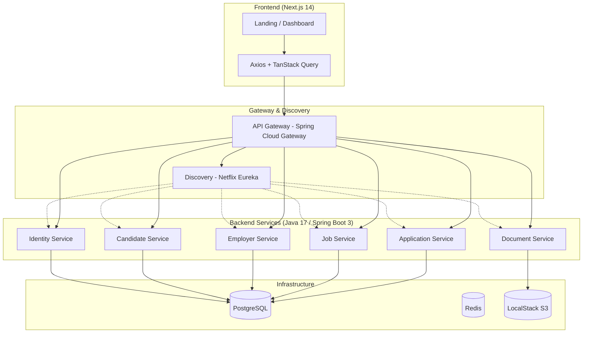

# 🏆 SportsMajors MVP

> **Connecting Elite International Student-Athletes with OPT-Friendly Careers.**

SportsMajors is a dedicated B2B/B2C career platform designed specifically for international student-athletes (F-1 / OPT). We bridge the gap between world-class talent and sports organizations looking for high-performance employees who understand teamwork, discipline, and strategy.

---

## 🌟 The Vision
The "Sports Major" is a unique profile: highly disciplined, culturally agile, and legally authorized through OPT (Optional Practical Training). However, navigating the US job market as an international student is complex. SportsMajors simplifies this by:
1. **Curating OPT-Friendly Employers**: No more guessing games on sponsorship.
2. **Athlete-First Profiles**: Highlighting sports achievements alongside academic excellence.
3. **Seamless Applications**: One-click applications to organizations that value the athlete's mindset.

---

## 🏗️ System Architecture



---

## 🛠️ Technology Stack

| Layer | Tech | Description |
| :--- | :--- | :--- |
| **Frontend** |  | React App Router, TypeScript, TailwindCSS, shadcn/ui |
| **Microservices** |  | Java 17, Spring Boot 3 |
| **Infrastructure** |  | Eureka (Discovery), API Gateway |
| **Security** |  | Stateless Auth with HttpOnly Cookies |
| **Database** |  | Primary relational store with Flyway migrations |
| **Storage** |  | LocalStack (Dev) / AWS S3 (Prod) |
| **DevOps** |  | Multi-stage builds, Docker Compose |
| **IaC** |  | AWS Infrastructure provisioning |

---

## 🚀 Getting Started

### Prerequisites
- [Docker & Docker Compose](https://www.docker.com/)
- [Terraform](https://www.terraform.io/) (for cloud deployment)
- [Postman](https://www.postman.com/) (to use the provided collection)

### Local Launch (Docker)
```bash
docker-compose up --build
```
*Wait for the services to initialize. All services will automatically register with Eureka.*

### Cloud Launch (Terraform)
1. Navigate to `terraform/`.
2. Copy `terraform.tfvars.example` to `terraform.tfvars` and configure your AWS credentials.
3. Initialize and deploy:
```bash
terraform init
terraform plan
terraform apply
```

### URLs
- **Frontend**: `http://localhost:3000`
- **API Gateway**: `http://localhost:8080/api/...`
- **Eureka Dashboard**: `http://localhost:8761`
- **Swagger Docs**: Available on each service port (e.g., `8081`, `8082`)

---

## ☕ Backend Development (Java & Spring)

### Prerequisites
- Java 17 (Azul Zulu or Oracle JDK)
- Maven 3.8+

### Build Instructions
To build the entire backend architecture:
```bash
cd backend
mvn clean install -DskipTests
```

### Core Frameworks & Patterns
- **Spring Boot 3.4**: Foundation for all microservices.
- **Spring Cloud 2024 (Eureka)**: Decentralized service discovery.
- **Spring Data JPA & Flyway**: Version-controlled schema migrations and robust data access.
- **Spring Security + JWT**: Centralized stateless authentication and RBAC.
- **Lombok & MapStruct**: Boilerplate reduction and efficient DTO/Entity mapping.
- **SpringDoc OpenAPI**: Automatic Swagger UI generation for API documentation.

### Running Services Individually
If you want to run a specific service without Docker:
1. Ensure a PostgreSQL instance is running on port `5432`.
2. Start the `discovery-service` first.
3. Use the Maven wrapper or your IDE to run the `main` class of the desired service.

---

## 📂 Project Structure
```text
SportsMajors/
├── backend/            # Spring Boot Microservices
│   ├── api-gateway/    # Entry point & Routing
│   ├── discovery-service/ # Eureka Service Discovery
│   ├── identity-service/  # JWT Auth & Security
│   ├── candidate-service/ # Athlete Profile Management
│   ├── employer-service/  # Organization Management
│   ├── job-service/       # Job Board & Search Logic
│   ├── application-service/ # Workflow Tracking
│   └── document-service/  # S3 Upload logic
├── frontend/           # Next.js Application
├── terraform/          # AWS IaC (VPC, ECS, RDS, S3)
├── docker-compose.yml  # Local Orchestration
└── SportsMajors_API_Collection.json # Postman Testing
```

---

## 🛡️ Key Features implemented in MVP
- ✅ **Infrastructure**: Service Discovery (Eureka) and API Gateway.
- ✅ **Cloud Ready**: Complete Terraform scripts for AWS (ECS Fargate, RDS).
- ✅ **Stateless Authentication**: High-security cookies across micro-services.
- ✅ **Dynamic Job Search**: Search by sport type, location, and OPT status.
- ✅ **Developer Experience**: Root `.gitignore`, Swagger UI, and Postman Ready.

---
*Developed by the SportsMajors Team | 2025*
