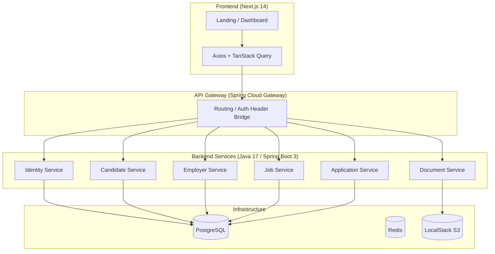

# 🏆 SportsMajors MVP

> **Connecting Elite International Student-Athletes with OPT-Friendly Careers.**

SportsMajors is a dedicated B2B/B2C career platform designed specifically for international student-athletes (F-1 / OPT). We bridge the gap between world-class talent and sports organizations looking for high-performance employees who understand teamwork, discipline, and strategy.

---

## 🌟 The Vision
The "Sports Major" is a unique profile: highly disciplined, culturally agile, and legally authorized through OPT (Optional Practical Training). However, navigating the US job market as an international student is complex. SportsMajors simplifies this by:
1. **Curating OPT-Friendly Employers**: No more guessing games on sponsorship.
2. **Athlete-First Profiles**: Highlighting sports achievements alongside academic excellence.
3. **Seamless Applications**: One-click applications to organizations that value the athlete's mindset.

---

## 🏗️ System Architecture



---

## 🛠️ Technology Stack

| Layer | Tech | Description |
| :--- | :--- | :--- |
| **Frontend** |  | React App Router, TypeScript, TailwindCSS, shadcn/ui |
| **Logic** |  | Java 17, Modular Monolith architecture |
| **Security** |  | Stateless Auth with HttpOnly Cookies |
| **Database** |  | Primary relational store with Flyway migrations |
| **Caching** |  | Rate limiting and session management |
| **Storage** |  | LocalStack for simulated document storage |
| **DevOps** |  | Multi-stage builds for every service |

---

## 🚀 Getting Started

### Prerequisites
- [Docker & Docker Compose](https://www.docker.com/)
- [Postman](https://www.postman.com/) (to use the provided collection)

### Quick Launch
```bash
docker-compose up --build
```
*Wait for the services to initialize. Flyway will automatically create the database schema.*

### URLs
- **Frontend Layer**: `http://localhost:3000`
- **Entry Gateway**: `http://localhost:8080/api`
- **Swagger Documentation**: `http://localhost:8081/swagger-ui.html` (Identity), `http://localhost:8082/...`

---

## 📂 Project Structure
```text
SportsMajors/
├── backend/            # Modular Monolith Root
│   ├── api-gateway/    # Entry point & Routing
│   ├── identity/       # JWT Auth & Security
│   ├── candidate/      # Athlete Profile Management
│   ├── employer/       # Organization Management
│   ├── job/            # Job Board & Search Logic
│   ├── application/    # Workflow Tracking
│   └── document/       # S3 Upload logic
├── frontend/           # Next.js Application
├── docker-compose.yml  # Full Stack Orchestration
└── SportsMajors_API_Collection.json # Postman Testing
```

---

## 🛡️ Key Features implemented in MVP
- ✅ **Stateless Authentication**: High-security cookies across micro-modules.
- ✅ **Modular Mono Architecture**: Scalable services communicating via a gateway.
- ✅ **Dynamic Job Search**: Search by sport type, location, and OPT status.
- ✅ **Developer Experience**: Root `.gitignore`, Swagger UI, and Postman Ready.

---
*Developed by the SportsMajors Team | 2025*
